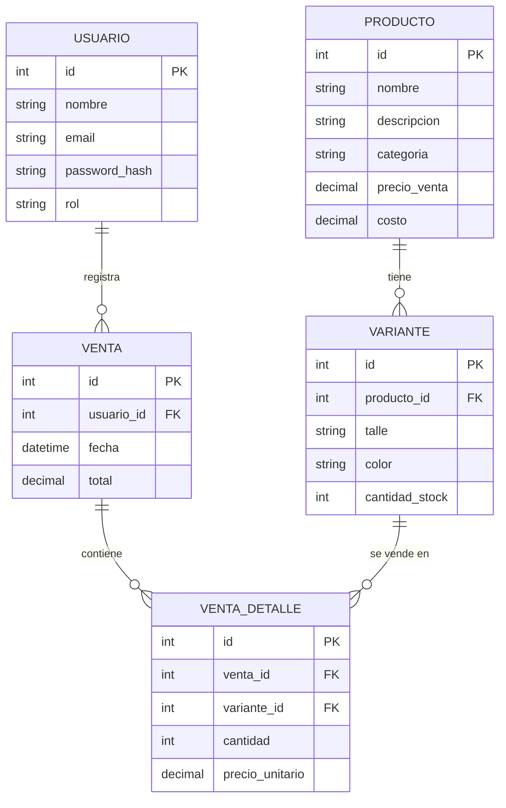
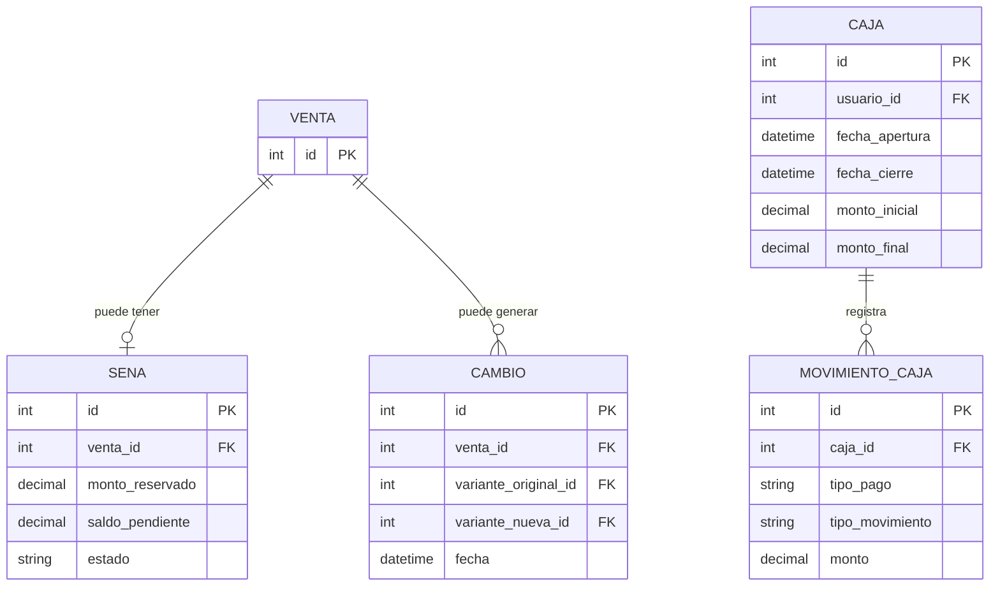

# 2.ª Entrega — Diseño y Módulos

**Proyecto:** Alabama Store — Sistema de gestión de ventas, stock y caja
**Trabajo Final Integrador — Tecnicatura Universitaria en Programación a Distancia — UTN**

---

## 1. Esquema de la base de datos

Modelo relacional (PostgreSQL). El diagrama cubre las entidades necesarias para el MVP definido en el README (gestión de stock por variante, ventas con descuento automático de stock, roles dueña/empleada). Se incluyen además, marcadas aparte, las tablas necesarias para las funcionalidades secundarias planificadas para una fase posterior (señas, cambios, caja), de modo que el modelo quede preparado para crecer sin romper el diseño del MVP.

### 1.1 Diagrama entidad-relación (MVP)

### 1.2 Extensión prevista (funcionalidades secundarias — fuera del MVP)

No se implementan en esta etapa; se dejan documentadas para que el modelo del MVP sea compatible con su incorporación futura.

### 1.3 Descripción de entidades (MVP)

| Tabla | Descripción |
|---|---|
| `usuario` | Personas que acceden al sistema. El campo `rol` distingue entre `dueña` y `empleada`, controlando la visibilidad de costos y ganancias. |
| `producto` | Artículo genérico de indumentaria (sin talle/color). Contiene precio de venta y costo (visible solo para el rol dueña). |
| `variante` | Combinación de talle y color de un producto, con su propio stock. Es la unidad real que se vende y descuenta. |
| `venta` | Cabecera de una venta: quién la registró y cuándo. |
| `venta_detalle` | Líneas de una venta: qué variantes, en qué cantidad y a qué precio unitario. Al confirmarse, descuenta stock de `variante`. |

---

## 2. Listado de módulos a desarrollar

Los módulos se agrupan según el alcance definido en el README: MVP (a desarrollar en esta etapa) y funcionalidades secundarias (diseñadas pero no implementadas todavía).

### 2.1 Módulos del MVP

| Módulo | Descripción |
|---|---|
| **Autenticación y roles** | Login de usuarios, manejo de sesión, y control de acceso diferenciado entre dueña (acceso completo) y empleada (sin acceso a costos/ganancias). |
| **Gestión de productos** | Alta, edición y consulta de productos: nombre, descripción, categoría, precio de venta y costo. |
| **Gestión de variantes y stock** | Alta de variantes (talle/color) por producto, consulta de stock disponible y actualización manual de cantidades. |
| **Carrito de venta** | Selección de variantes y cantidades antes de confirmar una venta. |
| **Registro de ventas** | Confirmación de la venta, generación del detalle (`venta_detalle`) y descuento automático de stock de las variantes vendidas. |
| **Panel de costos y ganancias** | Visualización de costos y márgenes, accesible solo para el rol dueña. |

### 2.2 Módulos de funcionalidades secundarias (diseño previsto, fuera del MVP)

| Módulo | Descripción |
|---|---|
| **Señas** | Apartar un producto con seña, reforzarla, y retirar con saldo pendiente. |
| **Cambios** | Registrar devolución o cambio de un producto ya vendido, vinculado a la venta original. |
| **Caja** | Apertura y cierre de caja, arqueo diario y registro de movimientos por tipo de pago. |
| **Aviso de reposición** | Notificación cuando se vende un producto exhibido y hay stock disponible en otra ubicación del local. |
| **Reportes** | Ranking de productos más vendidos y ganancias por período. |

---

